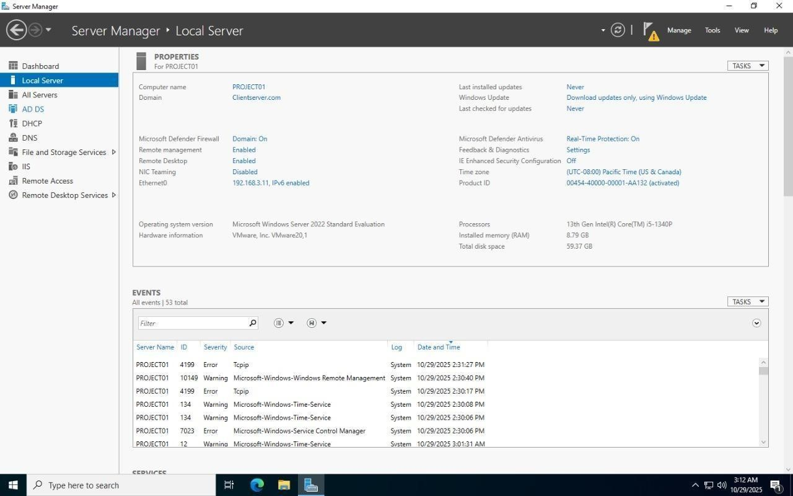
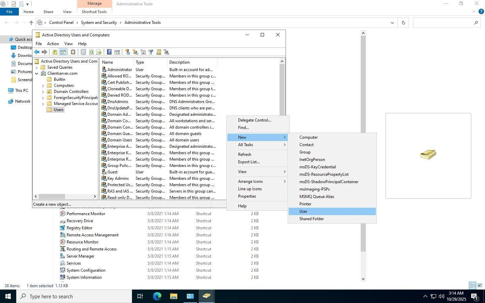
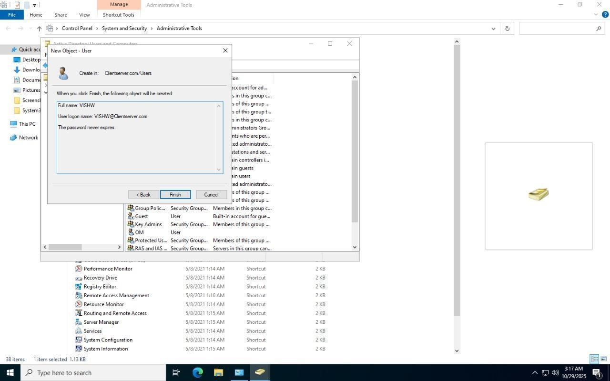
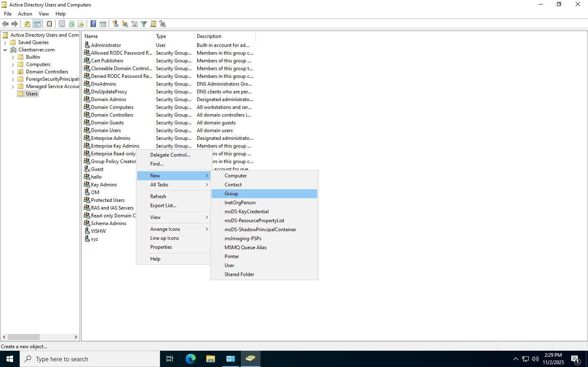
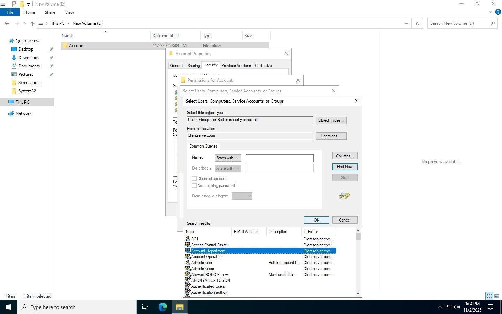
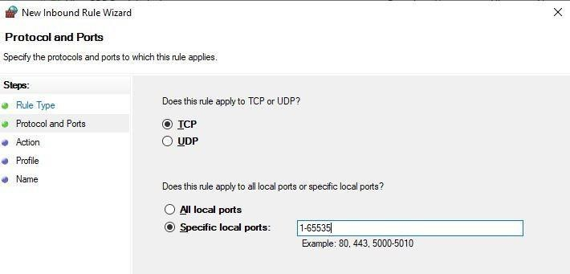
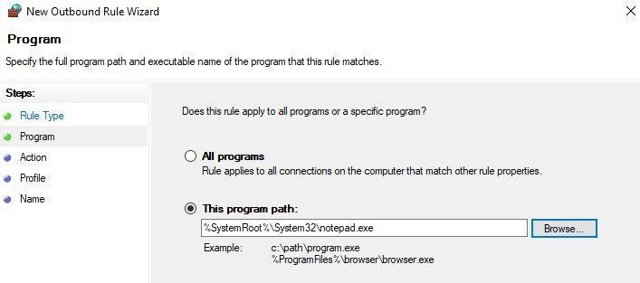
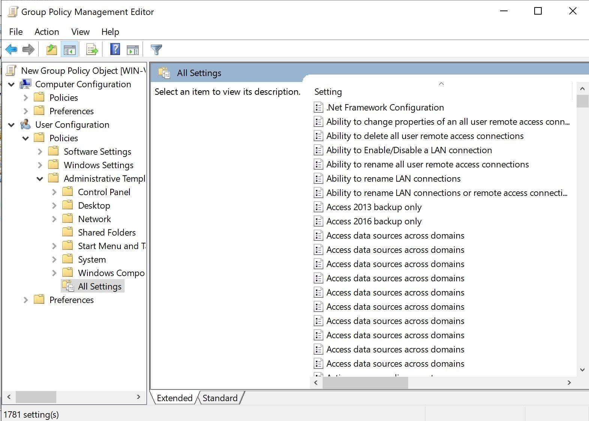

# Enterprise Active Directory Domain Infrastructure

## Overview

Designed and implemented a centralized Windows Server 2022 Active Directory environment providing authentication, authorization, DNS services, Group Policy management, firewall administration and secure resource sharing.

## Features

- Active Directory Domain Services (AD DS)
- DNS Server Configuration
- User and Group Management
- Role-Based Access Control (RBAC)
- Group Policy Management
- Windows Firewall Configuration
- Shared Folder Management
- Network Drive Mapping
- Domain Client Integration
- Security Auditing

## Architecture

(Add architecture diagram here)

## Screenshots

### Domain Controller

### Active Directory

### User Creation

### Group Management

### Folder Permissions

### Firewall Inbound Rules

### Firewall Outbound Rules

### Group Policy

### Domain Join

### Shared Drive Access

### Access Restriction

## Author

Om Patel
Network & Hardware Engineer
Cyber Security Student
=======
# Enterprise-Active-Directory-Domain-Infrastructure
Windows Server 2022 Active Directory deployment with DNS, Group Policy, Firewall Management, Shared Folders and Centralized Authentication.

